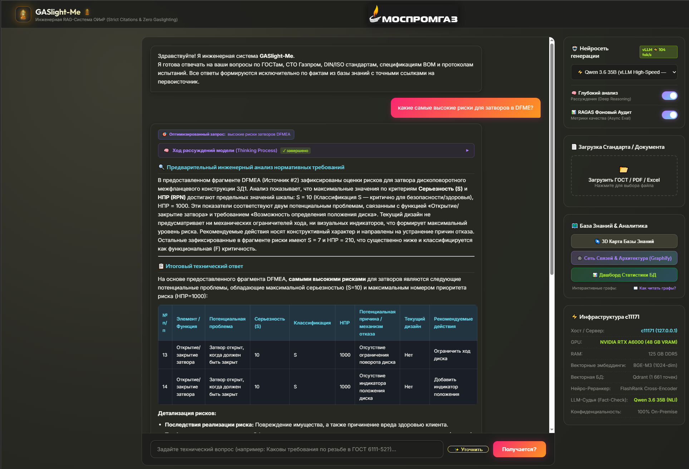
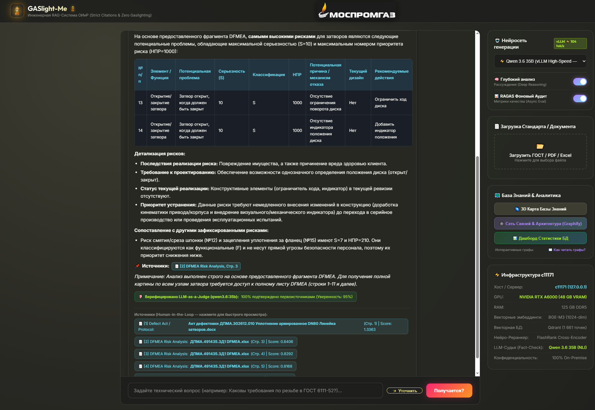
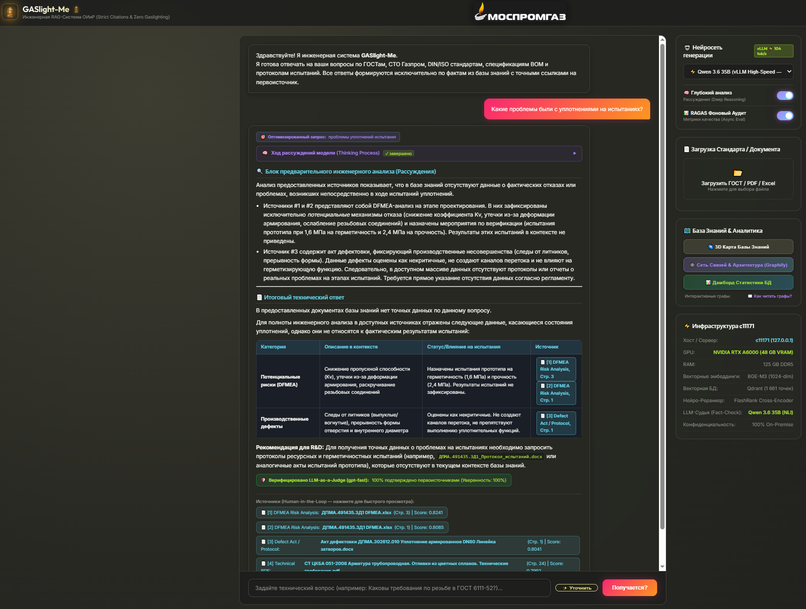
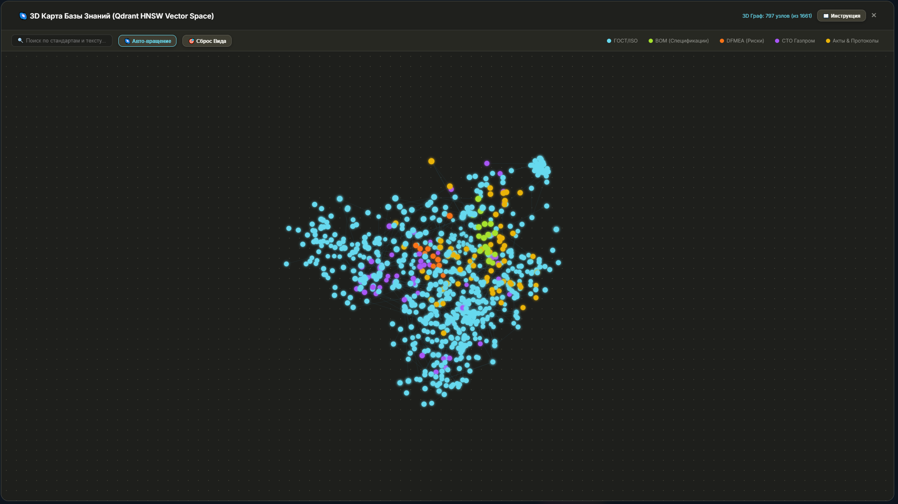
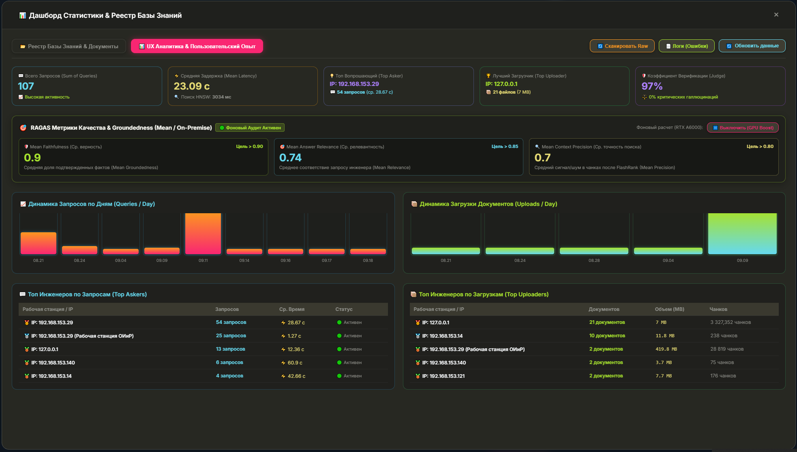
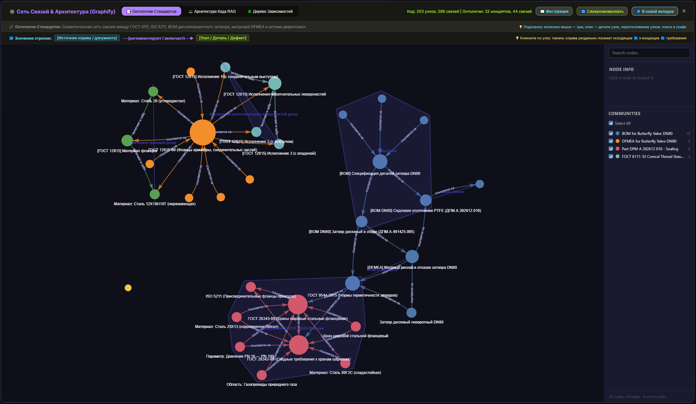
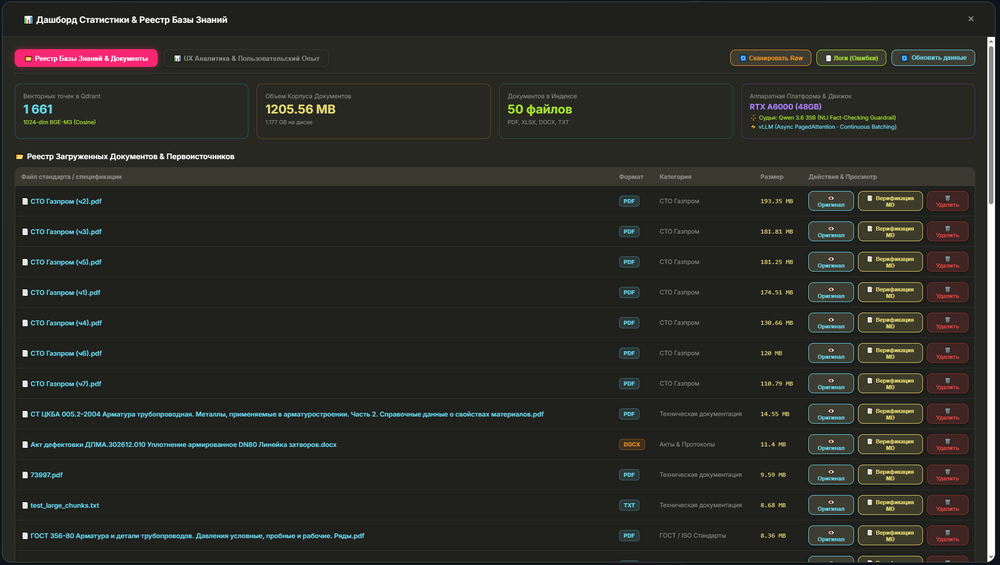
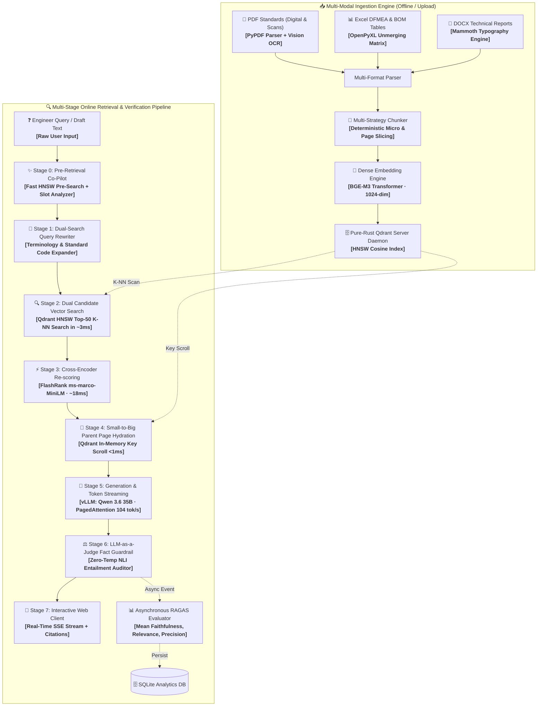

# 🪔 GASlight-Me: Enterprise On-Premise RAG for Engineering Standards

[](https://www.python.org/downloads/)
[](https://fastapi.tiangolo.com)
[](https://qdrant.tech)
[](https://github.com/vllm-project/vllm)
[](https://ollama.com)
[](https://opensource.org/licenses/MIT)

**GASlight-Me** is a high-performance, air-gapped Enterprise RAG (Retrieval-Augmented Generation) system built for technical engineering standards (Gazprom СТО, ГОСТ, ISO/DIN), Valve BOM Part Specifications, Defect Reports, and DFMEA Risk Matrices with **zero hallucinations**.

---

## 🌟 Key Architecture Highlights

* 🧠 **Small-to-Big Parent Page Hydration (PageIndex Pattern)**: Searches micro-chunks via HNSW + Cross-Encoder for pinpoint accuracy, then dynamically hydrates the **100% full parent page text** (headers, footnotes, units, tolerances) in `< 1 ms` before passing to the LLM generator.
* ⚡ **Dual-Engine High-Throughput Inference (vLLM & Ollama)**:
  - **High-Speed Primary Engine:** `vLLM` serving `Qwen 3.6 35B` with PagedAttention and Continuous Batching delivering **~104+ tok/s** and TTFT < 1.0s on NVIDIA RTX A6000 (48 GB).
  - **Resilient Fallback Engine:** `Ollama` running secondary models (`gpt-oss:20b`, `llama3.2-vision:11b`).
* 🎯 **Asynchronous RAGAS Evaluation Engine & UI Switch**:
  - Continuous non-blocking computation of core RAGAS metrics: **Mean Faithfulness**, **Mean Answer Relevance**, and **Mean Context Precision** stored in SQLite.
  - Interactive **Web UI toggle switch** allowing instant GPU relief during high-traffic hours.
* 🕸️ **Graphify Semantic Knowledge Ontology & 3D Visualizer**:
  - Interactive 3D vector space clustering (Qdrant HNSW) and community graph connecting standards (ГОСТ, ISO), assembly parts (BOM), and failure modes (DFMEA).
* ⚡ **Two-Stage Hybrid Retrieval**:
  1. **Stage 1 (Qdrant HNSW)**: Dense multilingual semantic search (`bge-m3`, 1024 dimensions) in **~3 ms** across thousands of document points.
  2. **Stage 2 (FlashRank)**: Cross-encoder deep attention re-scoring (`ms-marco-MiniLM-L-12-v2`) in **~18 ms**.
* ⚖️ **LLM-as-a-Judge Fact Auditor**: Autonomous NLI Premise-Hypothesis entailment guardrail computing Grounding Ratio (%) in real time with explicit unsupported claim detection.
* 🌐 **Universal In-Browser Document Previewer & Stage 1 MD Inspector**: Native rendering for `.xlsx` (interactive sheets & search), `.docx` (typography), `.pdf` (`#page=N`), and structured Stage 1 `.md` quality verification with zero downloads.
* 📈 **Client IP UX Analytics & Telemetry**: Embedded SQLite store logging real workstation client IPs, query latencies, and activity leaderboards.

---

## 📸 System Showcase & Visual Walkthrough

<div align="center">

### 1. Production Engineering Analysis & Deep Reasoning (vLLM 104 tok/s)

<p><em>Figure 1: Monokai Web Client — Query optimization, chain-of-thought reasoning (Thinking Process), and structured DFMEA risk matrix generation with deterministic tolerances (S=10, RPN=1000).</em></p>

<br/>

### 2. Verified LLM-as-a-Judge Guardrail & Interactive Citations

<p><em>Figure 2: Real-time fact verification badge (100% grounded, 95% confidence) with interactive Human-in-the-Loop source links (Defect Acts, DFMEA spreadsheets, Standards).</em></p>

<br/>

### 3. Transparent Chain-of-Thought & Deep Reasoning Analysis

<p><em>Figure 3: Advanced reasoning engine mitigating hallucinations by explicitly declaring missing data, displaying transparent Chain-of-Thought analysis, and structuring factual constraints in a tabular format.</em></p>

<br/>

### 4. Interactive 3D Knowledge Graph (Qdrant HNSW Vector Space)

<p><em>Figure 4: 3D PCA cluster visualization of vector points categorized by standards (ГОСТ/ISO, СТО Газпром, BOM specifications, DFMEA matrices, and test protocols).</em></p>

<br/>

### 5. UX Telemetry & Live Mean RAGAS Quality Dashboard

<p><em>Figure 5: Executive Dashboard showing Mean Faithfulness, Mean Answer Relevance, Mean Context Precision, latency metrics, and IP-based engineer leaderboards with GPU Boost toggle.</em></p>

<br/>

### 6. Graphify Knowledge Ontology & Component Dependency Network

<p><em>Figure 6: Multi-layered semantic ontology graph connecting regulatory standards (ГОСТ 12815, ISO 5211), assembly components (BOM butterfly valve DN80), and failure mechanisms.</em></p>

<br/>

### 7. High-Capacity Knowledge Base Registry & Document Hub

<p><em>Figure 7: Management of 1.2+ GB corpus (50 technical standards and defect acts), inline document previewer, Stage 1 Markdown verification, and hardware status.</em></p>

</div>

---

## 🏗️ Multi-Stage System Architecture



---

## ⚡ Latency & Component Benchmark

| Component | Technology | Latency | Deterministic? |
| :--- | :--- | :---: | :---: |
| **Vector Search** | Pure-Rust Qdrant (HNSW Cosine) | **~3 ms** | ✅ Yes |
| **Neural Reranking** | FlashRank (`ms-marco-MiniLM-L-12-v2`) | **~18 ms** | ✅ Yes |
| **Parent Page Hydration** | Qdrant In-Memory Key Scroll | **< 1 ms** | ✅ Yes |
| **LLM Generation** | Qwen 3.6 35B via vLLM (RTX A6000) | **~104 tok/s (SSE)** | ❌ (temp=0.1) |
| **Fact-Check Audit** | LLM-as-a-Judge (NLI Entailment) | **~350 ms** | ✅ (temp=0.0) |
| **RAGAS Background Eval** | Asynchronous Thread Worker Queue | **Non-blocking (0 ms user delay)** | ✅ Yes |
| **UX Telemetry Store** | Embedded SQLite3 (`data/analytics.db`) | **< 0.1 ms** | ✅ Yes |

---

## 🚀 Quickstart Guide

### 1. Prerequisites
- Python 3.10+
- NVIDIA GPU with CUDA support (Recommended: RTX 3090 / 4090 / A6000)
- [Qdrant](https://qdrant.tech/) vector database
- [vLLM](https://github.com/vllm-project/vllm) or [Ollama](https://ollama.com/)

### 2. Installation
```bash
git clone https://github.com/Dynobite/Gas_Enterprise_RAG_Engine.git
cd Gas_Enterprise_RAG_Engine
pip install -r requirements.txt
cp .env.example .env
```

### 3. Run Application
```bash
# Start FastAPI application
python -m uvicorn src.api:app --host 0.0.0.0 --port 8000
```
Open **`http://localhost:8000`** in your browser.

---

## 📄 License
This project is licensed under the MIT License — see the [LICENSE](LICENSE) file for details.
