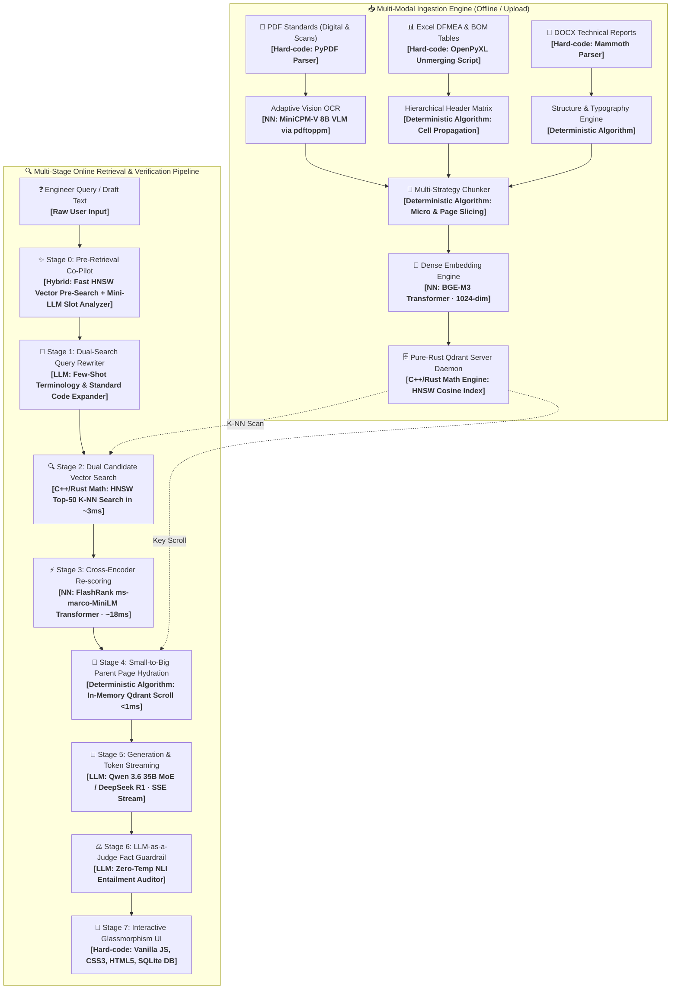

# 🪔 GASlight-Me: Enterprise On-Premise RAG for Engineering Standards

[](https://www.python.org/downloads/)
[](https://fastapi.tiangolo.com)
[](https://qdrant.tech)
[](https://ollama.com)
[](https://opensource.org/licenses/MIT)

**GASlight-Me** is a high-performance, air-gapped Enterprise RAG (Retrieval-Augmented Generation) system built for technical engineering standards (Gazprom STO, GOST, ISO), Valve BOM Part Catalogs, and DFMEA Risk Matrices with **zero hallucinations**.

---

## 🌟 Key Architecture Highlights

* 🧠 **Small-to-Big Parent Page Hydration (PageIndex Pattern)**: Searches micro-chunks via HNSW + Cross-Encoder for pinpoint accuracy, then dynamically hydrates the **100% full parent page text** (headers, footnotes, units, tolerances) in `< 1 ms` before passing to the LLM generator.
* ⚡ **Two-Stage Hybrid Retrieval**:
  1. **Stage 1 (Qdrant HNSW)**: Dense multilingual semantic search (`bge-m3`, 1024 dimensions) in **~3 ms** across 32,000+ points.
  2. **Stage 2 (FlashRank)**: Cross-encoder deep attention re-scoring (`ms-marco-MiniLM-L-12-v2`) in **~18 ms**.
* 👁️ **Adaptive Vision-Language OCR**: Automated raster PDF scan detection + instant sub-second `pdftoppm` rendering + direct base64 streaming to local `minicpm-v` (8B VLM) on GPU.
* 📊 **Hierarchical Table Preservation**: Native unmerging and multi-row header inheritance for Excel DFMEA and BOM specifications.
* ⚖️ **LLM-as-a-Judge Fact Auditor**: Autonomous NLI Premise-Hypothesis entailment guardrail computing Grounding Ratio (%) at zero temperature.
* 🌐 **Universal In-Browser Document Previewer**: Native HTML rendering for `.xlsx` (interactive sheets & search), `.docx` (typography), and `.pdf` (`#page=N`) with zero downloads.
* 📈 **Client IP UX Analytics & Telemetry**: Embedded SQLite store logging real workstation client IPs, query latencies, and activity leaderboards.

---

## 🏗️ Multi-Stage System Architecture



---

## ⚡ Latency & Component Benchmark

| Component | Technology | Latency | Deterministic? |
| :--- | :--- | :---: | :---: |
| **Vector Search** | Pure-Rust Qdrant (HNSW Cosine) | **~3 ms** | ✅ Yes |
| **Neural Reranking** | FlashRank (`ms-marco-MiniLM-L-12-v2`) | **~18 ms** | ✅ Yes |
| **Parent Page Hydration** | Qdrant In-Memory Key Scroll | **< 1 ms** | ✅ Yes |
| **LLM Generation** | Qwen 3.6 35B / DeepSeek R1 via Ollama | **~1.2 s (SSE Stream)** | ❌ (temp=0.1) |
| **Fact-Check Audit** | LLM-as-a-Judge (NLI Entailment) | **~350 ms** | ✅ (temp=0.0) |
| **UX Telemetry Store** | Embedded SQLite3 (`data/analytics.db`) | **< 0.1 ms** | ✅ Yes |

---

## 🚀 Quickstart Guide

### 1. Prerequisites
- Python 3.10+
- [Ollama](https://ollama.com/) with models installed:
  ```bash
  ollama pull bge-m3
  ollama pull qwen3.6:35b
  ollama pull minicpm-v:latest
  ```
- [Qdrant](https://qdrant.tech/) running on port `6333` (or via Docker).

### 2. Installation
```bash
git clone https://github.com/your-username/GASlight-Me-RAG.git
cd GASlight-Me-RAG
pip install -r requirements.txt
cp .env.example .env
```

### 3. Run with Docker Compose
```bash
docker-compose up -d
```

### 4. Direct Python Execution
```bash
# Start FastAPI application
python -m uvicorn src.api:app --host 0.0.0.0 --port 8000
```
Open **`http://localhost:8000`** in your browser.

---

## 📄 License
This project is licensed under the MIT License — see the [LICENSE](LICENSE) file for details.
