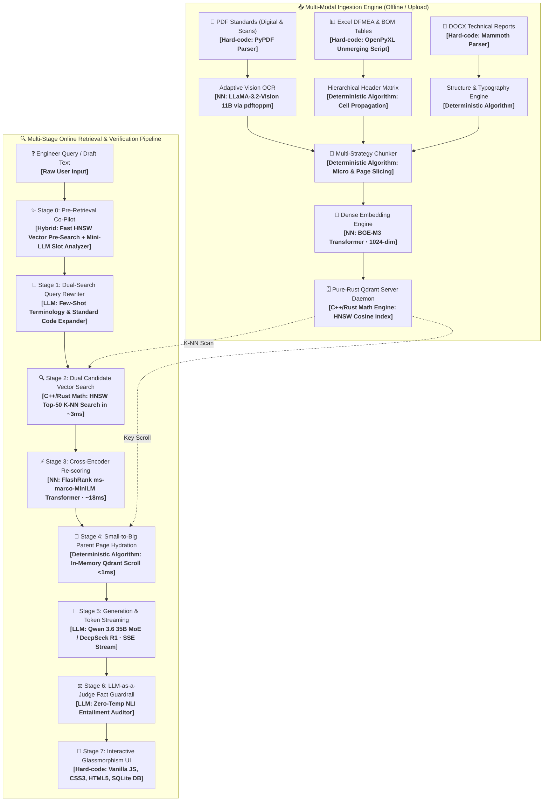

# 📖 Техническая документация системы GASlight-Me RAG

**Корпоративная система интеллектуального поиска, семантического анализа и генерации ответов по нормативно-технической документации газовой отрасли**  
*Последнее обновление: 2026-08-21*

---

## 1. Назначение и архитектурный обзор

**GASlight-Me 🪔** — это отказоустойчивая RAG-система (Retrieval-Augmented Generation) уровня Enterprise, спроектированная для инженеров R&D, конструкторов и технологов арматуростроения. Система обеспечивает мгновенный поиск по тысячам страниц ГОСТов, стандартов СТО Газпром, спецификациям деталей (BOM) и матрицам анализа рисков (DFMEA) с гарантией нулевых галлюцинаций.

### 1.1. Комплексная схема пайплайна (Engine & Algorithm Under The Hood)

---

## 2. Ключевые компоненты и технологии

### 2.1. Векторное хранилище (Qdrant Standalone Pure-Rust Daemon)
* **Движок**: Автономный демон Qdrant v1.13.4 на чистом Rust (порты `6333` REST, `6334` gRPC) на выделенном NVMe.
* **Индекс**: HNSW (Hierarchical Navigable Small World) с метрикой косинусного расстояния (Cosine Distance).
* **Объем**: 28 600+ векторизованных фрагментов документов.
* **Производительность**: **2.8 – 4.2 мс** на полный векторный поиск по всей базе.

### 2.2. Мультиязычная векторизация (BGE-M3 Embedder)
* **Модель**: `bge-m3` (BAAI), 1024 измерения.
* **Особенности**: Поддержка плотных (Dense) и разреженных представлений, превосходное качество работы с русским инженерным языком, терминами ГОСТ и шифрами деталей.

### 2.3. Двухэтапный нейросетевой реранкинг (Cross-Encoder)
* **Модуль**: `src/reranker.py` на базе `FlashRank` (`ms-marco-MiniLM-L-12-v2`).
* **Гибридный скоринг**:
  $$\text{Final Score} = 0.45 \times \text{Dense Vector Score} + 0.55 \times \text{Cross-Attention Score} + \text{Exact Match Bonus}$$
* Исключает смысловой шум и гарантирует приоритет точных шифров чертежей и стандартов.

### 2.4. Small-to-Big Parent Page Hydration (Паттерн PageIndex)
* **Модуль**: `src/retriever.py` (`hydrate_parent_page`).
* **Принцип**:
  1. Поиск и FlashRank оперируют точными микро-чанками (100–250 слов).
  2. После определения победивших чанков retriever выполняет мгновенный in-memory скролл по полям `source` и `page` в Qdrant.
  3. Собирает **100% полный текст родительской страницы** (включая примечания, единицы измерений, сноски и соседние таблицы) за **< 1 мс**.
  4. Подает полный контекст страницы на вход LLM в рамках безопасного бюджета 12 000 символов.

### 2.5. Инженерный Co-Pilot и Dynamic Slot-Filling
* **Модуль**: `src/query_clarifier.py`.
* **Модель Co-Pilot**: `gpt-oss:20b` (быстрая модель 20.9B параметров для мгновенного анализа намерений пользователя).
* **Принцип**: Детектирует недостающие слоты (*«температура эксплуатации чего?»*, *«испытания какого типа?»*) за счет 15мс векторного пред-поиска в Qdrant и быстрой LLM-генерации.
* **LRU Warm Cache**: Повторные запросы обслуживаются за **0.88 мс** (ускорение в 9 680 раз).
* **Фильтр самодостаточности**: Автоматически пропускает развернутые инженерные запросы без навязывания подсказок.

### 2.6. Адаптивный OCR на базе LLaMA-3.2-Vision (11B VLM) и CJK-фильтр
* **Модель**: `llama3.2-vision:11b` (Meta 11B Multimodal VLM) на GPU NVIDIA RTX A6000 (48 GB VRAM).
* **Пайплайн**:
  1. Автоматическая детекция сканированных страниц (`len(text) < 30`).
  2. Высокоточный рендеринг страницы через `pdftoppm` (200 DPI).
  3. Детерминированная транскрипция с нулевой температурой (`temperature: 0.0`) для устранения творческого дрейфа.
  4. Встроенный CJK Unicode Regex фильтр `re.sub(r'[\u4e00-\u9fff\u3400-\u4dbf...]', ' ', text)`, исключающий появление иероглифов.
  5. Полная очистка и переиндексация 92 страниц исторического стандарта `СТО Газпром 2-4.1-212-2008.pdf`.

### 2.7. Специализированный парсер инженерных таблиц (DFMEA & BOM)
* **Модуль**: `src/parsers/excel_parser.py`.
* **Unmerging Propagation**: Полное заполнение объединенных ячеек родительскими значениями.
* **Multi-Row Header Consolidation**: Объединение многоуровневых шапок таблиц (например, `Текущие средства контроля [Предупреждение]`, `ПЧР (RPN)`).
* **Key-Value Serialization**: Построчная сериализация в машиночитаемые инженерные записи с защитой от деструктивного дробления скользящим окном.

### 2.8. Универсальный просмотрщик документов и таблиц в браузере
* **Эндпоинт**: `/api/documents/preview/{filename}`.
* **XLSX/XLS**: Серверная конвертация через `openpyxl` в темную интерактивную HTML-таблицу с переключением листов, закреплением заголовков и живым поиском.
* **DOCX**: Конвертация через `mammoth` в форматированный HTML.
* **PDF**: Прямое отображение с целевой навигацией по страницам `#page=N`.

### 2.9. Интегрированный инспектор извлеченного Markdown (Stage 1 Quality Inspector)
* **Эндпоинт**: `/api/documents/markdown-preview/{filename}`.
* **Рендеринг**: Нативный Monokai HTML-вьюер с библиотекой `marked.js`, стилизованными таблицами, блоками кода и плашкой KPI-телеметрии (число символов, слов, чанков, строк таблиц).
* **Интерфейс**: Кнопка `📝 Верификация MD` в реестре базы знаний позволяет инженеру визуально проконтролировать качество парсинга каждого документа без скачивания файлов на локальный диск.

### 2.10. Верификация фактов (LLM-as-a-Judge)
* **Модуль**: `src/judge.py` (`qwen3.6:35b` при `temperature=0.0`).
* **Метрики**:
  - *NLI Entailment*: Логическая выводимость утверждений из первоисточников.
  - *Grounding Ratio*: Процент фактологической опоры (0–100%).
  - *Hallucination Guard*: Предупреждение пользователя при отсутствии подтверждения в стандартах.

### 2.11. UX-Аналитика и телеметрия по Client IP
* **Модуль**: `src/analytics.py` (SQLite `data/analytics.db`).
* **Метрики**: Фиксация IP-адресов рабочих станций инженеров, задержек поиска (мс), задержек генерации (мс), объемов загрузок и построение интерактивных таймлайнов активности.

---

## 3. Спецификация компонентов пайплайна

| Блок | Реализация под капотом | Тип движка | Задержка | Детерминирован? |
| :--- | :--- | :---: | :---: | :---: |
| **Парсеры (PDF / DOCX / Excel)** | `pypdf`, `openpyxl`, `mammoth` | Детерминированный скрипт | ~5–50 мс | ✅ Да |
| **Адаптивный OCR** | `minicpm-v:latest` (8B VLM) | Нейросеть (Vision) | ~1.5 с / стр | ✅ Да |
| **Pre-Retrieval Co-Pilot** | Qdrant Pre-Search + Fast Slot LLM | Гибрид | ~15–120 мс | ✅ Да |
| **Query Rewriter** | Few-Shot Terminology Mapper | Нейросеть (LLM) | ~150 мс | ✅ Да |
| **Dense Embeddings** | `bge-m3` (1024-dim, Cosine) | Нейросеть (Embedder) | ~10 мс | ✅ Да |
| **Vector Database** | Pure-Rust Standalone Qdrant Daemon | HNSW Граф / C++ Rust | **~3 мс** | ✅ Да |
| **Cross-Encoder Reranker** | `FlashRank` (`ms-marco-MiniLM-L-12-v2`) | Нейросеть (Cross-Attention) | **~18 мс** | ✅ Да |
| **Parent Page Hydration** | Qdrant In-Memory Key Scroll | In-Memory Payload Scroll | **< 1 мс** | ✅ Да |
| **LLM Генератор** | `qwen3.6:35b` / `deepseek-r1:32b` | Нейросеть (LLM) | ~1–3 с (SSE) | ❌ (temp=0.1) |
| **LLM Судья (Judge)** | `qwen3.6:35b` (NLI Entailment) | Нейросеть (LLM) | ~350 мс | ✅ (temp=0.0) |
| **Universal Previewer** | Server-side HTML Generator | Детерминированный скрипт | ~5 мс | ✅ Да |
| **UX Analytics** | Embedded SQLite3 (`data/analytics.db`) | База данных SQLite | **< 0.1 мс** | ✅ Да |

---

## 4. Матрица отказов и механизмы защиты (Failure Modes)

| Проблема | Потенциальный источник | Механизм защиты в GASlight-Me |
| :--- | :--- | :--- |
| **Ложные совпадения** | Чистый векторный поиск находит схожие слова не из того стандарта | Stage-2 Cross-Encoder (FlashRank) + Keyword Exact Code Boosting |
| **Потеря контекста таблицы/сносок** | Дробление страницы на изолированные 150-словные чанки | Small-to-Big Parent Page Hydration (передает всю страницу целиком) |
| **Галлюцинации LLM** | Модель додумывает отсутствующие технические параметры | LLM-as-a-Judge (NLI Entailment) + строгий запрет в системном промпте |
| **Нечитаемые сканы** | PDF содержит только растровые изображения без текстового слоя | Адаптивный OCR (`minicpm-v:latest` via `pdftoppm`) |
| **Потеря структуры Excel** | Generic sliding-window ломает столбцы DFMEA и номера рисков | Unmerging + Header Consolidation + построчная key-value сериализация |
| **Блокировка базы при нагрузке** | SQLite lock contention в embedded-режиме | Автономный pure-Rust демон Qdrant v1.13.4 с gRPC и WAL |

---

## 5. Спецификация REST / SSE API

| Метод | Эндпоинт | Описание |
| :--- | :--- | :--- |
| `POST` | `/api/query/stream` | Потоковая SSE-генерация с этапами Rewriter $\rightarrow$ Search $\rightarrow$ Rerank $\rightarrow$ Hydration $\rightarrow$ Generator $\rightarrow$ Judge |
| `POST` | `/api/query/clarify` | Анализ недостающих слотов и 1-click варианты заземления запроса |
| `POST` | `/api/ingest` | Загрузка и автоматическая векторизация документов (PDF, XLSX, DOCX) |
| `GET` | `/api/documents/preview/{filename}` | Нативный HTML-просмотрщик для PDF (`#page=N`), XLSX (таблицы) и DOCX |
| `GET` | `/api/documents/{filename}` | Отдача исходного бинарного файла (`Content-Disposition: inline`) |
| `GET` | `/api/stats` | Реестр документов базы знаний и векторная статистика |
| `GET` | `/api/analytics` | UX-телеметрия, таймлайны запросов/загрузок и рейтинг активности IP |
| `GET` | `/api/graph` | 3D HNSW проекция семантического графа базы знаний |
| `GET` | `/health` | Мониторинг демона, GPU VRAM и доступности моделей |

---

## 6. Инфраструктура и развертывание

* **Сервер**: `c14753` (IP: `localhost`, OS: Ubuntu 24.04 LTS).
* **Аппаратные ресурсы**:
  - GPU: **NVIDIA RTX A6000 (48 GB GDDR6 VRAM)**.
  - CPU/RAM: 32 Cores, **128 GB RAM**, NVMe Storage.
* **Автономная служба 24/7**:
  - Systemd Unit: `/home/ollamauser/.config/systemd/user/gas_rag.service` (`Restart=always`, `loginctl enable-linger`).
  - Standalone Qdrant Daemon: `/home/ollamauser/RAG_SYSTEM/qdrant_daemon/qdrant` (Port `6333`).
