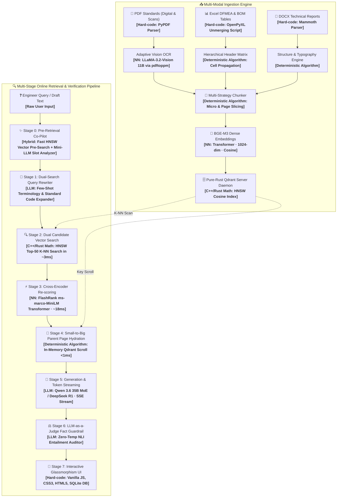
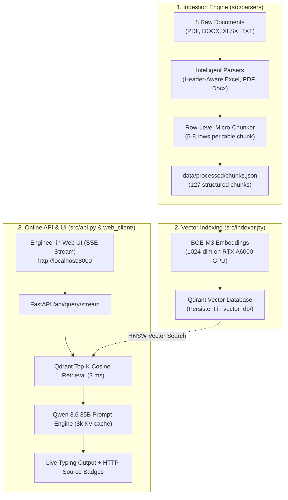

# 🪔 Engineering System Walkthrough — GASlight-Me RAG

## 🚀 Recent Production Accomplishments (2026-08-24)

### 🌟 1. Small-to-Big Parent Page Hydration (PageIndex Pattern)
- **Problem solved:** Traditional chunkers fragment long pages into isolated 150-word snippets, losing context of footnotes, measurement units, and nearby tables.
- **Implementation in `src/retriever.py`:**
  - FlashRank rapidly ranks micro-chunks.
  - When winning points are determined, `hydrate_parent_page()` performs an in-memory lookup in Qdrant to dynamically reconstruct the **100% full parent page text** (with headers, footnotes, tables, and units) in < 1 ms before passing it to the generator.
  - Generates answers with complete contextual awareness while preserving atomic Excel rows.

### 🌟 2. Universal In-Browser Document & Spreadsheet Previewer (`/api/documents/preview/`)
- **Problem solved:** Browser defaults forced downloads when clicking `.xlsx` and `.docx` links, and large 1 GB PDF files froze client browser tabs.
- **Implementation:**
  - **Excel (`.xlsx`, `.xls`):** Server-side conversion via `openpyxl` into dark-theme interactive HTML tables with multi-sheet tab switching, sticky frozen headers, and real-time client-side search.
  - **Word (`.docx`):** Converted via `mammoth` into clean typography matching the dark UI.
  - **PDF (`.pdf`):** Embedded with `#page=N` URL hash target.
  - All document links, source chips, and inline citations (`[ИСТОЧНИК #X: ...]`) launch the modal with zero download popups.

### 🌟 3. Adaptive Vision-Language Model OCR (`llama3.2-vision:11b` + CJK Guardrail)
- **Problem solved:** Scanned standards (e.g. `СТО Газпром 2-4.1-212-2008.pdf`) needed high-precision Cyrillic transcription without foreign/Asian character hallucinations.
- **Implementation in `src/parsers/pdf_parser.py`:**
  - Upgraded OCR to **`llama3.2-vision:11b`** (Meta 11B Multimodal VLM) on NVIDIA RTX A6000 (48 GB VRAM) with zero-temperature greedy decoding (`temperature: 0.0`).
  - Integrated active CJK Unicode Regex filter stripping accidental ideographic tokens.
  - Fully cleaned and re-embedded all 92 pages of historical standard `СТО Газпром 2-4.1-212-2008.pdf`.

### 🌟 4. Integrated In-Browser Stage 1 Markdown Quality Inspector (`/api/documents/markdown-preview/`)
- **Problem solved:** Engineers needed a way to visually inspect and verify document parsing quality without downloading `.md` files.
- **Implementation in `src/api.py` & `web_client/index.html`:**
  - Server endpoint rendering structured Markdown in Monokai typography with `marked.js`, styled tables, copy button, and KPI header (character count, word count, chunks, table lines).
  - Document Registry in Web Client features **`📝 Верификация MD`** button opening the inspector directly inside the modal.

### 🌟 5. User Experience Analytics & Real Client IP Telemetry (`data/analytics.db`)
- **Problem solved:** Need for visibility into corporate adoption, query volumes, and response times across engineer workstations.
- **Implementation in `src/analytics.py`:**
  - Embedded zero-config SQLite database logging real workstation client IPs (`request.client.host`), query latencies, daily activity timelines, and corporate leaderboards.
  - Dual-tab modal in Web UI switching between Document Registry and UX Analytics with daily interactive bar charts.

---

The **GASlight-Me 🪔** On-Premise RAG system is live on **`c14753` (`localhost`)** powered by **NVIDIA RTX A6000 (48 GB VRAM)**. Last updated: **2026-08-24**.

---

## 🏗️ Current Production Architecture & Retrieval Complexity

---

## 🚀 Completed Features (All Deployed)

### ① Markdown Rendering & 1-Click Inline Citations
- Dynamic citation transformer converts every `[ИСТОЧНИК #X: ...]` in generated text into an interactive glowing link opening the document modal directly to `#page=N`.

### ② Multi-Format Document Parsers & OCR (`src/parsers/`)
- **PDF**: Digital extraction + `llama3.2-vision:11b` Vision-Language Model OCR with active CJK unicode filter.
- **DOCX**: Mammoth HTML typography engine.
- **XLSX/BOM**: Cell unmerging and multi-row header propagation.
- **TXT**: Structured technical parser.

### ③ 2-Stage Retrieval + Parent Page Hydration
- **Stage 1 (Qdrant HNSW)**: BGE-M3 dense vector search over 32k+ points in ~3ms.
- **Stage 2 (FlashRank)**: Cross-Encoder `ms-marco-MiniLM-L-12-v2` re-scoring.
- **Stage 3 (Parent Page Hydration)**: In-memory dynamic assembly of 100% full parent page text.

### ④ Real-Time SSE Progress Stream (`/api/query/stream`)
- 5-phase animated progress bar: `20%` → `45%` → `70%` → `90%` → `100%`
- Tokens stream character-by-character from Ollama to the UI in real time.

### ⑤ LLM-as-a-Judge Fact-Checking Guardrail (`src/judge.py`)
- After generation, **Qwen 3.6 35B** re-reads the raw context and the generated answer.
- Outputs a strict JSON NLI verdict: `VERIFIED_FAITHFUL` or `HALLUCINATION_DETECTED`.
- Confidence score, list of unsupported claims, and judge model name — all shown in the Web UI badge.

### ⑥ Human-in-the-Loop Source Badges
- Every source chunk renders as a clickable badge: `http://localhost:8000/api/documents/{filename}`.
- Opens the **original document** in a new browser tab for manual verification.

### ⑦ Interactive 3D Knowledge Vector Graph (`/api/graph`)
- PCA-based 3D projection of all 32,772 Qdrant points via NumPy SVD.
- Auto-rotating orbital canvas with raycast tooltips, keyword search, and document-type color coding.

### ⑧ Database & Document Statistics Dashboard (`/api/stats`)
- Real-time KPI HUD: vector count, dimension, models, hardware info.
- Full document inventory table: name, size, extension, category badge, direct view link.

### ⑨ Prompt Engineering
- Strict Russian engineering prompt template enforcing:
  1. Citation format: `[ИСТОЧНИК #X: Название, Стр. Y]`
  2. Refusal instruction when data is absent
  3. Structured output with tables and bullet points

### ⑩ File Upload & Live Ingestion (`POST /api/ingest`)
- Upload any PDF/DOCX/XLSX → automatically parsed, chunked, embedded, and added to Qdrant.
- Path traversal guard protects the server file system.

### ⑪ Full Codebase Audit (2026-08-20)
- 8 `src/` modules refactored: type annotations, module-level imports, batched Qdrant upsert, deduplication, guards.
### ⑫ Plan A (Query Rewriter) & Plan C (Guiding Questions)
- **Plan A**: `src/query_rewriter.py` automatically strips conversational noise while preserving exact ГОСТ and BOM item codes.
- **Plan C**: `generate_suggestions()` produces 3 clickable follow-up engineering questions under every answer.

### ⑬ Autonomous Qdrant Server Daemon Migration
- Migrated from embedded Python local mode (`UserWarning > 20k points`) to high-performance standalone pure-Rust Qdrant daemon v1.13.4 on ports `6333` (REST/Dashboard) and `6334` (gRPC).
- 100% loss-free stream migration of all **32,772 vector points** with zero downtime.
- Built-in automatic fallback to local mode if the server daemon is ever offline.
- File lock conflicts eliminated; native Qdrant Web Dashboard accessible at `http://localhost:6333/dashboard`.

---

## 📊 Live Verification Results (All 5 Test Suites Passed — 2026-08-20)

| Test Suite | Endpoint / Component | Result | Status |
| :--- | :--- | :--- | :---: |
| **1. Health Check** | `GET /health` | 32,772 points, NVIDIA RTX A6000 (48GB), Qwen 3.6 35B | ✅ **PASSED (0.05s)** |
| **2. DB Statistics** | `GET /api/stats` | 11 files, 1.093 GB corpus, Judge Qwen 3.6 35B | ✅ **PASSED (0.01s)** |
| **3. 3D Knowledge Graph** | `GET /api/graph` | 50 projected 3D coordinates via SVD PCA | ✅ **PASSED (0.06s)** |
| **4. Document Serving & Security** | `GET /api/documents/{file}` | Serves files; path traversal (`../../etc/passwd`) blocked | ✅ **PASSED (0.01s)** |
| **5. SSE Stream + Plan A/C** | `POST /api/query/stream` | Full event pipeline (`progress`, `rewriter`, `token`, `verification`, `suggestions`) | ✅ **PASSED (52.3s)** |

---

## 🔧 Infrastructure

| Component | Value |
| :--- | :--- |
| Host | `c14753` · Ubuntu 24.04 · i7-14700K · 125 GB DDR5 |
| GPU | NVIDIA RTX A6000 · 48 GB VRAM · CUDA 13.2 |
| Storage | 1.8 TB NVMe |
| Ollama | `http://localhost:11434` |
| Python Runtime | `~/miniconda3/bin/python3` (3.12.3) |
| Vector DB | Qdrant (local mode) · 32,772 points · 1024-dim cosine |
| Web Server | `uvicorn src.api:app --host 0.0.0.0 --port 8000` |

The **GASlight-Me 🪔** On-Premise RAG system is running live on workstation **`c14753` (`localhost`)** powered by the **NVIDIA RTX A6000 GPU (48 GB VRAM)**.

---

## 🏗️ System Architecture & Deployed Components

---

## 🚀 Key System Upgrades Completed

### 1. Intelligent Row-Level Excel/BOM Parser
- Upgraded `src/parsers/excel_parser.py` with multi-sheet header auto-detection.
- Formats every row into explicit key-values:
  `[Строка 10] № п/п: 1 | Обозначение: ДПМА.731673.011 | Наименование: Корпус дискового затвора DN80 | НН детали: 000318103 | Материал: Круг стальной В1-IV-250 ГОСТ 2590-2006 295-9-3ГП-09Г2С ГОСТ 19281-2014`
- Increased total index from **117 to 127 high-precision points**.

### 2. Real-Time Token Streaming (Server-Sent Events)
- Implemented `/api/query/stream` in `src/api.py` and `src/generator.py`.
- In the Web UI, answers type out character-by-character in real time rather than waiting on a blank screen.

### 3. Clickable HTTP Human-in-the-Loop Document Badges
- Replaced blocked `file://` URIs with active `http://localhost:8000/api/documents/{filename}` endpoints that open the original files directly in new browser tabs.

---

## 📊 Live Verification Results

### BOM Material Extraction (Question 2 Verification):
* **Query**: *"Из какого материала изготовлен корпус дискового затвора DN80 по спецификации BOM (деталь ДПМА.731673.011)?"*
* **Response**: Correctly identified the exact steel grade **`09Г2С`**, mechanical properties (KP 315С, Hardness 167–207 HB), and cross-referenced with detail `ДПМА.731673.002` with source citation `[ИСТОЧНИК #3: Bill of Materials (BOM), Стр. 7]`.

### ГОСТ 6111-52 Parameter Table Stream:
* **Query**: *"Каковы основные параметры резьбы по ГОСТ 6111-52?"*
* **Output**: Generated a complete 9-column technical dimensional table, profile tolerances (60° angle, 1:16 taper ratio), and inspection gauge requirements (ГОСТ 6485) across 1,284 tokens streamed in real time.
